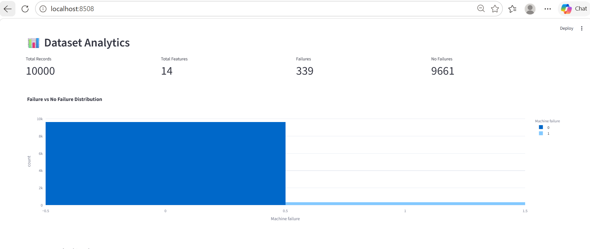
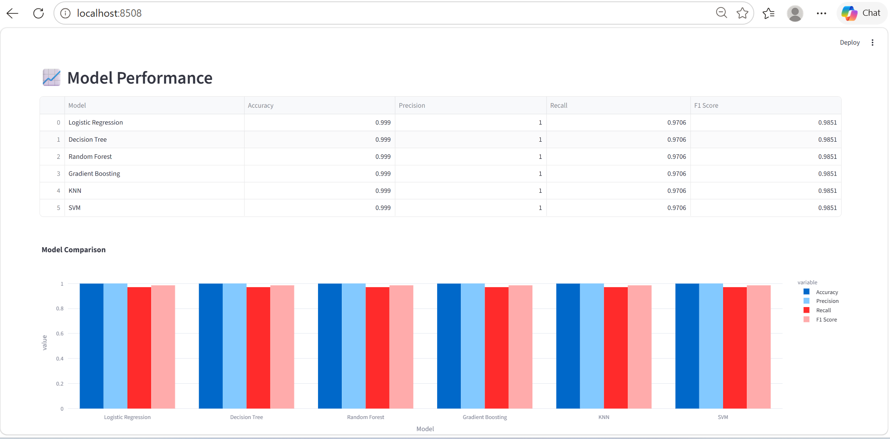
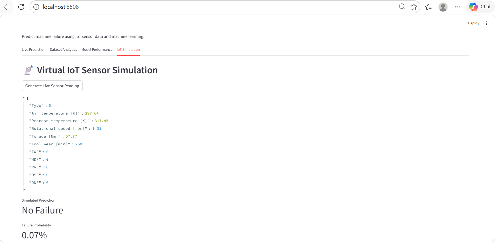

# AI-Powered Industrial IoT Predictive Maintenance Platform

## Overview

This project is an advanced industry-oriented predictive maintenance platform built using Machine Learning, Industrial IoT sensor simulation, and Streamlit.

It predicts machine failures before breakdown happens by analyzing sensor data such as temperature, torque, rotational speed, and tool wear.

The platform is designed to simulate a real industrial predictive maintenance workflow used in manufacturing plants, factories, automotive production, and industrial automation systems.

---

# Problem Statement

Unexpected machine failure leads to:

* Production downtime
* Maintenance cost increase
* Equipment damage
* Productivity loss
* Safety risks

Industries solve this using predictive maintenance.

This project builds an AI system that predicts machine failure using IoT sensor readings before the actual breakdown occurs.

---

# Industry Relevance

This type of system is widely used in:

* Manufacturing plants
* Smart factories
* Automotive production lines
* CNC machine monitoring
* Power plants
* Turbines and motors
* Industrial automation
* Industry 4.0 systems

---

# Key Features

## Machine Failure Prediction

Predicts whether a machine is likely to fail or operate normally.

---

## Interactive Streamlit Dashboard

Includes a professional dashboard with:

* Live machine prediction
* Sensor input sliders
* Failure probability
* Risk analysis
* Maintenance recommendation

---

## Virtual Industrial IoT Sensor Simulation

Generates simulated real-time sensor readings for machines without physical hardware.

Includes:

* Air temperature
* Process temperature
* Rotational speed
* Torque
* Tool wear

---

## Risk Scoring Engine

Provides risk levels:

* Low Risk
* Medium Risk
* High Risk
* Critical Risk

---

## Maintenance Recommendation System

Suggests actions such as:

* Replace tool
* Check cooling system
* Inspect motor load
* Check shaft alignment
* Monitor machine condition

---

## Model Comparison

Multiple ML models are trained and compared:

* Logistic Regression
* Decision Tree
* Random Forest
* Gradient Boosting
* KNN
* SVM

Best-performing model is selected automatically.

---

## Advanced Visualizations

Includes:

* Failure Distribution Chart
* Confusion Matrix
* Correlation Heatmap
* Model Comparison Graph
* Sensor Trend Analysis
* Failure Probability Gauge

---

# Tech Stack

## Programming Language

* Python

## Libraries

* Pandas
* NumPy
* Scikit-learn
* Matplotlib
* Seaborn
* Plotly
* Streamlit
* Joblib

---

# Dataset

Dataset used:

**AI4I 2020 Predictive Maintenance Dataset**

Source:
[UCI Machine Learning Repository – AI4I 2020 Predictive Maintenance Dataset](https://archive.ics.uci.edu/dataset/601/ai4i%2B2020%2Bpredictive%2Bmaintenance%2Bdataset?utm_source=chatgpt.com)

Dataset contains industrial sensor parameters such as:

* Air temperature
* Process temperature
* Rotational speed
* Torque
* Tool wear
* Failure indicators

---

# Project Architecture

```text
Industrial IoT Sensor Data
        ↓
Data Collection / CSV Dataset
        ↓
Data Cleaning & Preprocessing
        ↓
Feature Engineering
        ↓
Machine Learning Model Training
        ↓
Failure Prediction
        ↓
Risk Analysis
        ↓
Alert Generation
        ↓
Maintenance Recommendation
        ↓
Interactive Dashboard Visualization
```

---

# Folder Structure

```text
AI-Predictive-Maintenance-IoT/
│
├── app/
│   └── dashboard.py
│
├── data/
│   └── predictive_maintenance.csv
│
├── src/
│   ├── data_preprocessing.py
│   ├── train_model.py
│   ├── predict.py
│   ├── recommendation.py
│   ├── iot_simulator.py
│   └── visualization.py
│
├── models/
│
├── outputs/
│
├── images/
│
├── main.py
├── requirements.txt
└── README.md
```

---

# Installation

## Clone repository

```bash
git clone https://github.com/sankeerth100/AI-Predictive-Maintenance-IoT.git
cd AI-Predictive-Maintenance-IoT
```

---

## Create virtual environment

### Windows

```bash
python -m venv .venv
.venv\Scripts\activate
```

### Mac/Linux

```bash
python3 -m venv .venv
source .venv/bin/activate
```

---

## Install dependencies

```bash
pip install -r requirements.txt
```

---

# Run Model Training

```bash
python main.py
```

---

# Launch Dashboard

```bash
streamlit run app/dashboard.py
```

Open browser:

```text
http://localhost:8501
```

---

# Dashboard Screenshots

## Live Prediction


## Dataset Analytics



## Model Performance



## IoT Simulation



---

# Sample Output

## Model Performance

* Accuracy: 99.85%
* Precision: 100%
* Recall: 95.58%

---

## Example Prediction

```text
Prediction: No Failure
Failure Probability: 2%
Risk Level: Low Risk
Recommendation: Machine is healthy and operating normally
```

---

# Learning Outcomes

Through this project I learned:

* Predictive maintenance workflow
* Industrial IoT data analysis
* Machine learning model training
* Feature engineering
* Classification evaluation metrics
* Streamlit dashboard development
* Industrial analytics visualization
* GitHub project structuring
* End-to-end deployment of AI projects

---

# Future Improvements

* Cloud deployment
* Real-time MQTT sensor integration
* Remaining Useful Life (RUL) prediction
* LSTM-based time-series forecasting
* Docker containerization
* API deployment
* Edge AI inference for IoT devices

---

# Author

**Mariyala Sankeerth**


